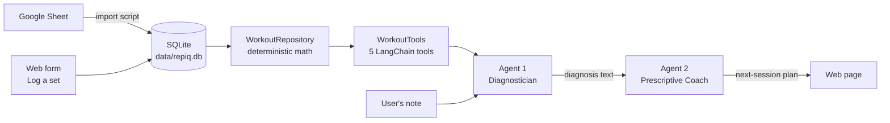

# RepAi

**An AI-powered lifting coach that tells you what to do in your next session — without needing a human coach.**

You log your sets (weight, reps, how many reps you *planned*, and a quick note like *"shoulder felt off"*). RepAi crunches the numbers, then two AI agents work in sequence: the first figures out **what's going on** with your training, the second tells you **exactly what to do next**.

> The app is branded **RepIQ** in the UI and agent prompts; the repository is **RepAi**.

---

## Table of contents

- [How it works](#how-it-works)
- [Project structure](#project-structure)
- [Setup](#setup)
- [Running the app](#running-the-app)
- [Getting data in](#getting-data-in)
- [Demo walkthrough](#demo-walkthrough)
- [Tests](#tests)
- [Development workflow](#development-workflow)
- [Known issues & next steps](#known-issues--next-steps)
- [Team](#team)

---

## How it works



The design keeps **math and AI separate**:

| Layer | File | Job | Uses an LLM? |
|---|---|---|---|
| Data / app logic | `app_logic/workout_repository.py` | Owns the SQLite database and every calculation | ❌ No |
| Tools | `agents/workout_tools.py` | Wraps the repository's calculations as tools Agent 1 can call | ❌ No |
| **Agent 1 — Diagnostician** | `agents/diagnostician_agent.py` | A LangGraph ReAct agent. Decides *which* metrics it needs, calls the tools, combines them with your note, and writes a short diagnosis (e.g. fatigue, form breakdown, injury risk, normal progression). It does **not** prescribe. | ✅ Yes |
| **Agent 2 — Prescriptive Coach** | `agents/coach_agent.py` | A single LLM call. Reads only Agent 1's diagnosis and returns a concrete plan: exercises, weights, sets, reps, or a deload/substitution. | ✅ Yes |
| Pipeline | `agents/pipeline.py` | Runs Agent 1 → Agent 2 and returns `{"diagnosis": ..., "plan": ...}` | — |
| Web app | `web/app.py` | Flask site: history, summary metrics, log-a-set form, coaching page | — |

Both agents use Anthropic's **`claude-sonnet-5`** via `langchain-anthropic`.

### The metrics

All computed in `WorkoutRepository` — plain Python + SQL, no AI, fully tested.

| Metric | How it's calculated |
|---|---|
| **Weekly volume** | Sum of `weight × reps` for the exercise over the last 7 days |
| **Estimated 1RM** | Epley formula on the most recent set: `weight × (1 + reps / 30)`, rounded to 0.1 |
| **Progression trend** | Estimated 1RM for every set in the last N weeks (default 8), oldest first |
| **Rep deficit** | `planned_reps − reps` on the most recent set (positive = reps missed) |

### Agent 1's tools

| Tool | Returns |
|---|---|
| `list_recent_sets(exercise, limit=5)` | Recent sets with weight, reps, planned reps and notes |
| `get_weekly_volume(exercise)` | Total volume over the last 7 days |
| `get_one_rep_max_estimate(exercise)` | Current estimated 1RM |
| `get_progression_trend(exercise, weeks=8)` | 1RM over time |
| `get_rep_deficit(exercise)` | Reps missed vs. plan on the latest set |

Every tool returns a readable "no data" message instead of crashing, so Agent 1 can say *"insufficient data"* rather than make things up.

---

## Project structure

```
RepAi/
├── agents/
│   ├── diagnostician_agent.py   # Agent 1 (ReAct agent + tools)
│   ├── coach_agent.py           # Agent 2 (single LLM call)
│   ├── pipeline.py              # Agent 1 → Agent 2 glue
│   └── workout_tools.py         # Repository calculations exposed as LangChain tools
├── app_logic/
│   └── workout_repository.py    # SQLite + all deterministic math
├── scripts/
│   ├── seed_fake_data.py        # Inserts 10 demo sets and prints the metrics
│   └── import_from_sheets.py    # Google Sheet → SQLite
├── web/
│   ├── app.py                   # Flask app
│   └── templates/
│       ├── history.html         # Log-a-set form, summary, all sets
│       └── coach.html           # Note form + diagnosis + plan
├── tests/                       # pytest suite (see "Tests")
├── data/                        # repiq.db lives here (created automatically, git-ignored)
├── credentials/                 # Google service-account key (git-ignored)
├── pytest.ini
├── requirements.txt
└── .env                         # ANTHROPIC_API_KEY (git-ignored, you create it)
```

---

## Setup

**Requirements:** Python 3.10+ and an [Anthropic API key](https://console.anthropic.com/).

```bash
# 1. Clone and enter the project
git clone https://github.com/Rudraraj8606/RepAi.git
cd RepAi

# 2. Create a virtual environment (recommended)
python3 -m venv .venv
source .venv/bin/activate        # Windows: .venv\Scripts\activate

# 3. Install dependencies
pip install -r requirements.txt

# 4. Add your Anthropic API key
echo "ANTHROPIC_API_KEY=sk-ant-..." > .env
```

> 🔒 `.env`, `credentials/` and `*.db` are all in `.gitignore`. Never commit API keys.

**Run every command from the `RepAi/` folder** — the code uses module imports (`python -m ...`) and the relative path `data/repiq.db`.

---

## Running the app

```bash
# Load demo data (optional, but recommended the first time)
python -m scripts.seed_fake_data

# Start the web app
python -m web.app
```

Open **http://127.0.0.1:5000**.

| Page | What you see |
|---|---|
| `/` | **Log a set** form, a **Summary** table (weekly volume, est. 1RM, missed reps per exercise) and **All logged sets** |
| `/coach/<exercise>` | Asks how your last session felt, then runs both agents and shows the **Diagnosis** and **Recommendation** |

The coaching page only calls the AI once you submit a note, so just opening it doesn't spend API credits.

### Running the agents from the terminal

```bash
python -m agents.diagnostician_agent   # Agent 1 only, Bench Press + "shoulder felt off"
python -m agents.coach_agent           # Agent 2 only, on a sample diagnosis
python -m agents.pipeline              # Full Agent 1 → Agent 2 chain
```

---

## Getting data in

There are three ways to add workouts. All of them end up in `data/repiq.db`.

### 1. Web form (easiest)

Use **Log a set** at the top of the home page. Fields: date (defaults to today), exercise (autocompletes from exercises you've already logged), weight, reps, planned reps (optional), notes. Invalid input shows an error instead of saving.

### 2. Demo data

```bash
python -m scripts.seed_fake_data
```

Inserts 10 sets across Bench Press, Squat, Deadlift and Overhead Press, then prints every metric. The Bench Press data is built to tell a story: steady progress from 135 → 145 lbs, then a drop to 135 × 8 (planned 10) with the note *"shoulder felt off"*.

> Running it twice inserts the sets twice. Delete `data/repiq.db` to start fresh.

### 3. Google Sheets

**One-time setup**

1. In [Google Cloud Console](https://console.cloud.google.com/), create (or pick) a project and enable the **Google Sheets API** and **Google Drive API**.
2. Go to **IAM & Admin → Service Accounts**, create a service account, then **Keys → Add key → JSON** to download its key file.
3. Save the key as `credentials.json` in the `RepAi/` folder (this is where `scripts/import_from_sheets.py` currently looks — see [Known issues](#known-issues--next-steps)).
4. Open your Google Sheet → **Share** → add the service account's `client_email` (from the JSON file, ends in `iam.gserviceaccount.com`) as a **Viewer**.
5. Set `SHEET_NAME` in `scripts/import_from_sheets.py` to your sheet's exact name (default: `"RepIQ Workout Log"`).

**Sheet format** — first tab, these exact headers in row 1:

| date | exercise | weight | reps | planned_reps | notes |
|---|---|---|---|---|---|
| 2026-09-20 | Bench Press | 145 | 9 | 10 | good session |
| 2026-09-22 | Squat | 185 | 5 | | |

- `date` must be `YYYY-MM-DD`
- `planned_reps` and `notes` can be blank
- Rows missing a `date` or `exercise` are skipped

**Import**

```bash
python -m scripts.import_from_sheets
```

---

## Demo walkthrough

A 3-minute demo that shows the whole system:

1. **Start fresh:** `rm -f data/repiq.db && python -m scripts.seed_fake_data`
2. **Launch:** `python -m web.app` and open http://127.0.0.1:5000
3. **Show the metrics:** point out Bench Press in the Summary — estimated 1RM and **2 missed reps** in red.
4. **Log a set live:** `Bench Press · 130 lbs · 6 reps · planned 10 · "shoulder pain again"` → it appears instantly and the summary updates.
5. **Get coaching:** click **Get coaching →** on Bench Press, enter *"shoulder felt off again, pressing felt weak"*, submit.
6. **Explain the output:**
   - **Agent 1** called the tools itself (you'll see `[Tool] ...` lines in the terminal), noticed the drop in weight and reps alongside the shoulder note, and diagnosed it.
   - **Agent 2** turned that diagnosis into a specific plan — never seeing the raw data, only the diagnosis.

---

## Tests

The test suite uses **pytest** and runs in about a second. **No test calls the Anthropic API or Google** — the AI pipeline and Sheets connection are replaced with fakes, and every test uses its own temporary database, so your real `data/repiq.db` is never touched.

```bash
pytest              # run everything
pytest -v           # list every test by name
pytest tests/test_web_app.py          # one file
pytest -k rep_deficit                 # tests whose name matches
```

`pytest.ini` puts the project root on the import path, so plain `pytest` works from `RepAi/`.

| File | Tests | What it covers |
|---|---|---|
| `tests/test_repository.py` | 20 | The core math. Weekly volume (including the exact 7-day cutoff and ignoring other exercises), Epley 1RM and its rounding, progression curve window and order, rep deficit (missed, beaten, no plan, no data), newest-first ordering, distinct exercise list, empty database, and automatic creation of the `data/` folder. |
| `tests/test_workout_tools.py` | 11 | The exact text Agent 1 receives from each of the 5 tools, plus the "no data" message each tool returns instead of crashing. |
| `tests/test_pipeline.py` | 1 | Agent 1's output is passed to Agent 2, and the pipeline returns `{"diagnosis", "plan"}`. Both agents are faked. |
| `tests/test_web_app.py` | 12 | History page (empty and with data), the log-a-set form (saves, strips whitespace, redirects; planned reps optional; rejects bad weight, bad reps, bad date, blank exercise, missing fields), and the coach page (doesn't run the AI without a note, shows diagnosis + plan with one, shows a friendly error if the pipeline fails). |
| `tests/test_import_from_sheets.py` | 3 | Converting Sheet rows to database rows the way `gspread` returns them (ints, strings, blanks), skipping blank rows, and a missing `notes` column. |

**Total: 47 tests.**

### What the tests don't cover

- The **quality** of the agents' answers — that needs a real API call and human judgment. Run `python -m agents.pipeline` to check by hand.
- The live **Google Sheets connection** — only the row-conversion logic is tested.

---

## Development workflow

### Branching

`main` is the stable branch. Don't commit to it directly.

```bash
git checkout main
git pull                              # get the latest
git checkout -b fix/short-description # or feat/..., test/..., docs/...
```

Branch name prefixes used in this repo:

| Prefix | For |
|---|---|
| `feat/` | New functionality (e.g. `feat/agent2-coach-and-pipeline`) |
| `fix/` | Bug fixes (e.g. `fix/agent-auth-and-model-update`) |
| `test/`, `docs/` | Tests or documentation only |

### Before you commit

```bash
pytest                                # all tests must pass
git status                            # make sure no .env, credentials or .db files are staged
```

Keep commits small and focused: one logical change per commit, with a message that says what changed and why (e.g. *"Remove stray underscore that broke diagnostician_agent import"*).

### Pull requests

1. Push your branch: `git push -u origin <branch-name>`
2. Open a PR into `main` on GitHub.
3. In the description, include a **Summary**, the **Problem** (for fixes), what you **Changed**, and how you **Verified** it (tests run, commands tried).
4. Your teammate reviews and merges.

### Adding a new metric (example)

1. Add a method to `WorkoutRepository` (no LLM calls in that file).
2. Add tests for it in `tests/test_repository.py`.
3. Expose it to Agent 1 as a new `@tool` in `WorkoutTools.get_tools()` and add it to the returned list.
4. Add a test in `tests/test_workout_tools.py`.
5. Optionally show it in the Summary table (`web/app.py` + `history.html`).

---

## Known issues & next steps

- **Sheets key location:** `import_from_sheets.py` reads `credentials.json` from the project root, but `.gitignore` only ignores the `credentials/` folder, so a root key file could be committed by accident. Planned fix: read from `credentials/credentials.json`.
- **Re-importing duplicates data:** running the Sheets import (or the seed script) twice inserts every row again, which inflates weekly volume. Planned fix: skip rows that already exist.
- **LangGraph deprecation:** `create_react_agent` is deprecated and should be migrated to `langchain.agents.create_agent` before LangGraph v2.0.
- **Not yet done:** user accounts, editing/deleting logged sets, and charts of the progression trend.

---

## Team

| | Role |
|---|---|
| [@Rudraraj8606](https://github.com/Rudraraj8606) | Data layer, Google Sheets import, web app |
| [@benpopisith](https://github.com/benpopisith) | Agent 2 (Prescriptive Coach), pipeline, auth & model setup |

Built as a side project for **CS 601 at the University of San Francisco**.

## License

[Apache License 2.0](LICENSE)
